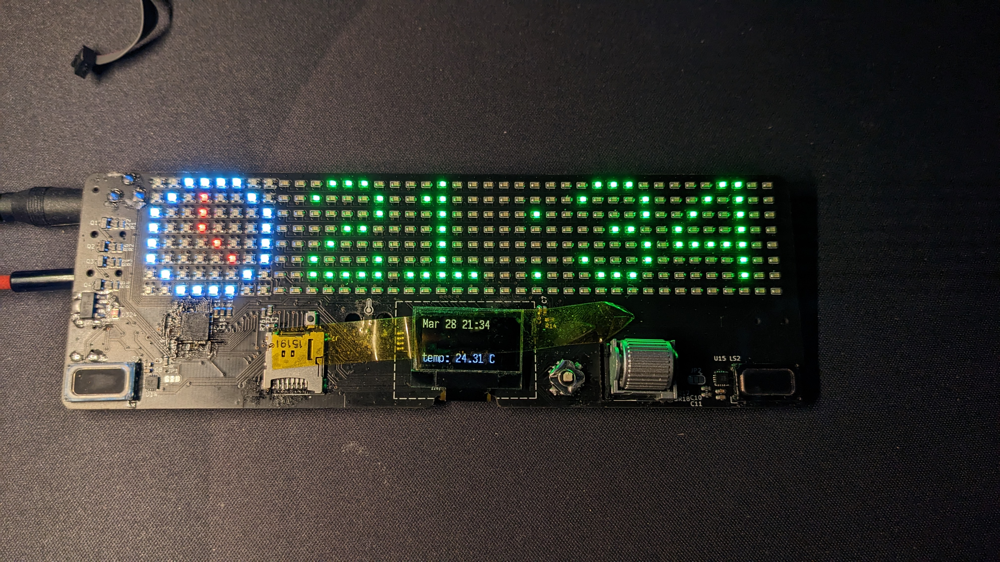
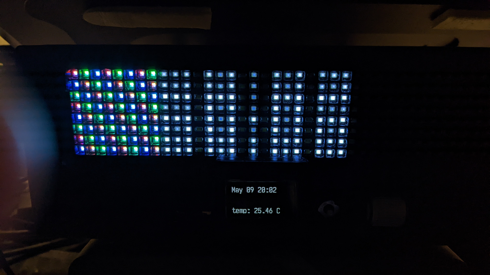
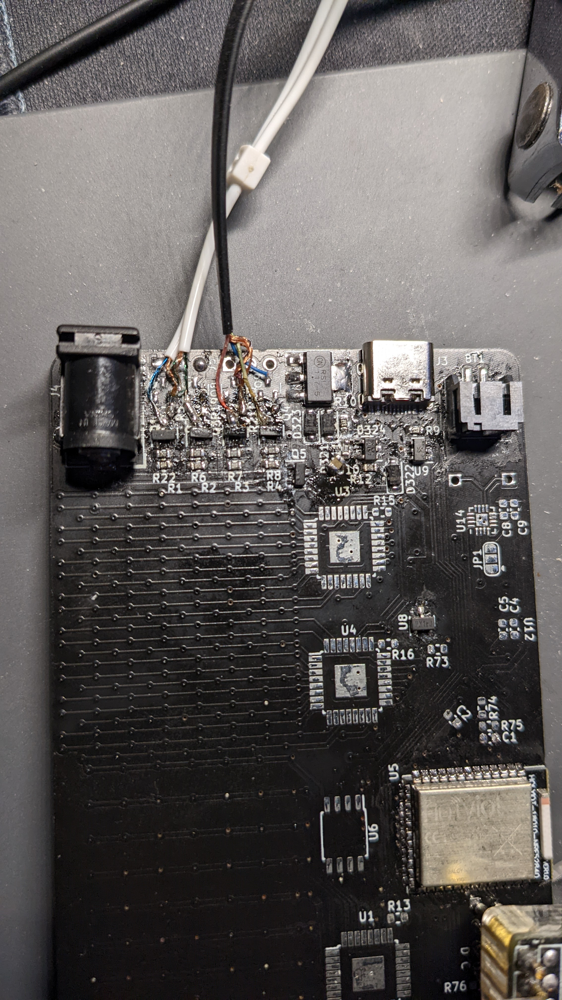
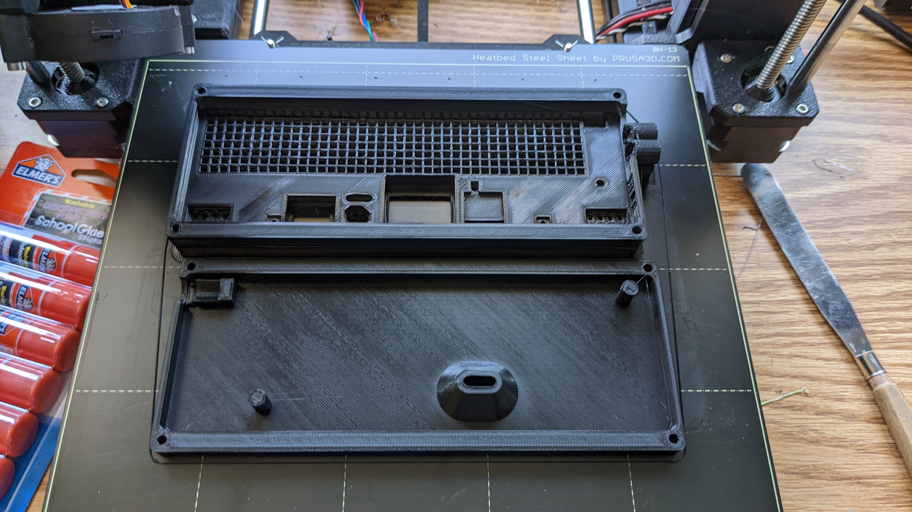

# Zeub

zeub is meant to be a pixel clock and a IoT hub. The name comes from a smooshed version of zeit (German for time) and hub.

It currently has:
- a 8x8 RGB LED matrix and a 32x8 white LED matrix
- 2 2-channel LED strip controllers (for controlling LED strips with warm and cool white lights in my room)
- a 128x64 OLED screen
- a TMP117 precision temperature sensor
- 2 front facing speakers, using 2 MAX98357 DACs
- a DS3212 battery backed RTC
- a EVQWGD001 rotary encoder, and a 5-way joystick
- a nRF52840 microcontroller, which supports USB, BLE and 802.15.4 (ZigBee etc.) protocols

Version 2 assembled displaying a clock icon and time (the right side is green because uh.. I messed up the PCBA parts assignment): 

The current firmware fetches the current time (once; supports connection at 2 times for drift correction) from a CTS (Current Time Service) from a BLE connection. This is currently done using my phone through the nRF Connect app. The time is then displayed on both the LED matrix (along with a clock icon), and the OLED along with the date and current temperature. It also sets the brightness of one LED strip using a preconfigured (but can be reconfigured through BLE) schedule. The other LED strip (which is actually my desk light) is controlled by the scroll wheel. It also streams audio from the USB to the speakers, for testing of the audio interface.

The hub part of the project still doesn't really exist yet, as I haven't had time to get to it.

Version 1 has basically the same features, but also included 2 microphones for testing. However the LED matrix did not work properly as I used 2 LED matrix controllers together in the same matrix.

The LED strips were also connected through a TRRS cable but without an actual connector, as I flipped the control polarity of the LED strips (they are common anode instead of common cathode).

Case iterations for v1 (the cone in the back is for better airflow to the temperature sensor, for more accurate reading of the environment):

